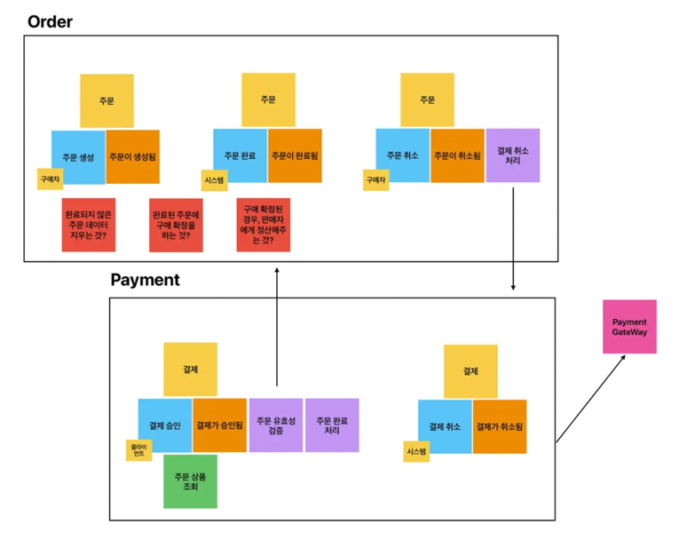

# 🏦 토스페이먼츠 기반 주문-결제 시스템

## 프로젝트 개요

토스페이먼츠 API를 활용한 주문 및 결제 시스템을 **Event-Driven DDD** 기반으로 구현합니다.
**Event Storming**으로 도메인을 분석하고, **ATDD** 방식으로 개발합니다.

## 핵심 목표

- [x] Spring REST Docs를 통한 API 문서화
- [x] Event Storming 기반 도메인 설계
- [x] 클린 아키텍처 (Hexagonal Architecture)
- [ ] Domain-Driven Design (DDD)
    - Bounded Context 분리 (Order / Payment)
    - Aggregate 설계
    - Domain Event를 통한 Policy 구현
- [ ] ATDD (Acceptance Test-Driven Development)

---

## Event Storming 결과

### **Bounded Context 분리**

```
┌─────────────────────────┐
│   Order Context         │
│  - Order Aggregate      │
└─────────────────────────┘
           ↕ Domain Event
┌─────────────────────────┐
│  Payment Context        │
│  - Payment Aggregate    │
└─────────────────────────┘
```



### **Event Flow**

```
Phase 1: 주문 생성
구매자 → 주문 생성 (Command)
      → 주문이 생성됨 (Event)

Phase 2-A: 결제 승인
클라이언트 → 결제 확인 (Command)
          → 결제가 승인됨 (Event)
          → [Policy] 주문 완료 처리
          → 주문이 완료됨 (Event)

Phase 2-B: 결제 실패
클라이언트 → 결제 확인 (Command)
          → 결제가 실패됨 (Event)
          → [Policy] 주문 취소 처리
          → 주문이 취소됨 (Event)

Phase 3: 사용자 주문 취소
구매자 → 주문 취소 (Command)
      → 주문이 취소됨 (Event)
      → [Policy] 결제 취소 처리
      → 결제가 취소됨 (Event)
```

---

## 기능 요구사항

### **Phase 1: 주문 생성**

#### **사용자 스토리**

```
구매자로서, 상품을 선택하여 주문을 할 것이다.
주문 후 카드 결제를 할 것이다.
```

#### **인수 조건 (Acceptance Criteria)**

- [x] 구매자는 주문자 정보(이름, 전화번호)를 입력한다
    - `Orderer`
- [x] 구매자는 1개 이상의 상품을 선택한다
    - `OrderItems`
- [x] 각 상품은 ID, 이름, 가격, 수량을 포함한다
    - `Product`
- [x] 시스템은 총 주문 금액을 자동으로 계산한다
    - `OrderItems.calculate`
- [x] 시스템은 고유한 주문 ID(UUID)를 발급한다
    - `OrderId`
- [x] 주문 생성 후 주문 상태는 "ORDER_COMPLETED"이다
    - `OrderStatus`

#### **도메인 규칙**

```
Order Aggregate 불변식:
- 주문 항목 ≥ 1개
- 총 금액 = Σ(각 항목의 단가 × 수량)
- 주문자 이름: 필수, 2~20자
- 전화번호: 010으로 시작하는 11자리 (하이픈 없이)
- 상품 가격: 0원 이상
- 주문 수량: 1개 이상
```

#### **이벤트**

- `OrderCreated`: 주문이 생성되었다

---

### **Phase 2: 결제 승인**

#### **사용자 스토리**

```
클라이언트는 토스페이먼츠로부터 결제 요청 후,
결제 승인 결과를 서버로 전달해 주문 상태를 업데이트하고 싶다.
```

#### **인수 조건 (Acceptance Criteria)**

**Phase 2-A: 결제 승인 성공**

- [ ] 클라이언트는 결제 확인 요청을 보낸다
- [ ] 시스템은 주문 상태가 "ORDER_COMPLETED"인지 확인한다
- [ ] 시스템은 주문 금액과 결제 금액이 일치하는지 검증한다
- [ ] 토스페이먼츠 API를 통해 결제를 승인한다
- [ ] 결제 승인 시 Payment Aggregate를 생성한다
- [ ] 결제 원장(PaymentLedger)에 거래 내역을 기록한다
- [ ] `PaymentApproved` 이벤트가 발행된다
- [ ] [Policy] 주문 상태가 "PAYMENT_FULLFILL"로 변경된다

**Phase 2-B: 결제 실패**

- [ ] 결제 승인 실패 시 `PaymentFailed` 이벤트가 발행된다
- [ ] [Policy] 주문 상태가 "ORDER_CANCELLED"로 변경된다

#### **도메인 규칙**

```
Payment Aggregate 불변식:
- 주문 금액 = 결제 금액
- 중복 결제 방지 (이미 결제된 주문은 재결제 불가)
- 주문 상태 = ORDER_COMPLETED (결제 가능 상태)

Order Aggregate 상태 전이:
ORDER_COMPLETED → PAYMENT_FULLFILL (결제 성공)
ORDER_COMPLETED → ORDER_CANCELLED (결제 실패)
```

#### **이벤트**

- `PaymentApproved`: 결제가 승인되었다
- `PaymentFailed`: 결제가 실패했다
- `OrderPaymentCompleted`: 주문이 완료되었다 (Policy)
- `OrderCancelled`: 주문이 취소되었다 (Policy)

---

### **Phase 3: 사용자 주문 취소**

#### **사용자 스토리**

```
구매자는 결제 완료된 주문을 취소하고 싶다.
최종적으로 환불을 받게 된다.
```

#### **인수 조건 (Acceptance Criteria)**

- [ ] 구매자는 주문 취소를 요청한다
- [ ] 시스템은 주문이 취소 가능한 상태인지 검증한다
- [ ] 시스템은 취소 사유를 입력받는다
- [ ] 전체 취소 또는 부분 취소를 선택할 수 있다
- [ ] 부분 취소 시 특정 주문 항목을 선택한다
- [ ] `OrderCancelled` 이벤트가 발행된다
- [ ] [Policy] 결제 취소가 요청된다
- [ ] 토스페이먼츠 API를 통해 결제를 취소한다
- [ ] 결제 원장에 취소 내역을 기록한다
- [ ] `PaymentCancelled` 이벤트가 발행된다

#### **도메인 규칙**

```
Order Aggregate:
- 취소 가능 상태: PAYMENT_FULLFILL
- 부분 취소 시 항목별 취소 가능

Payment Aggregate:
- 취소 금액 ≤ 잔여 금액 (balanceAmount)
- 이미 취소된 금액 추적
- 취소 사유 필수
```

#### **이벤트**

- `OrderCancelled`: 주문이 취소되었다
- `PaymentCancelled`: 결제가 취소되었다 (Policy)

## 설계 제약사항

### **Domain Layer**

- [ ] 순수 Java 객체만 사용
- [ ] JPA 어노테이션 금지
- [ ] 프레임워크 독립적
- [ ] VO는 `record`로 작성
- [ ] Aggregate Root는 일관성 경계 보장

### **의존성 방향**

```
Adapter → Application → Domain
(외부)      (유스케이스)   (핵심)
```

### **검증 책임**

- [ ] Request DTO: @NotNull 정도만 (null 방어)
- [ ] VO (Value Object): 비즈니스 규칙 검증
- [ ] Aggregate: 불변식 보장

### **Aggregate 설계**

- [ ] ID로만 참조 (직접 참조 금지)
- [ ] 트랜잭션 경계 = Aggregate 경계
- [ ] Domain Event로 Aggregate 간 통신
